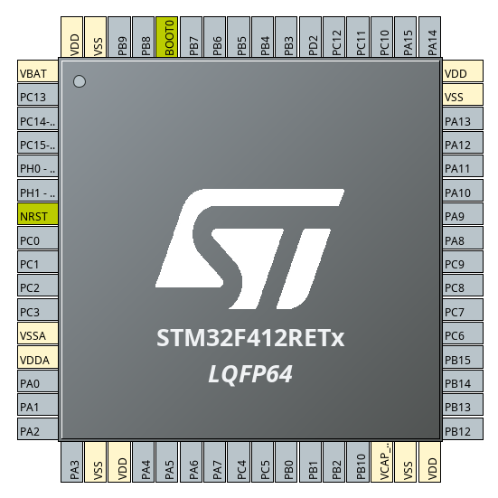

# STM32F412RET6 (LQFP64)

- **Part Number**: STM32F412RET6
- **Core**: ARM Cortex-M4, 32-bit
- **Flash Memory**: 512 kB
- **Data SRAM**: 256 kB
- **Operating Voltage**: 1.7V - 3.6V
- **I/O count**: 50 pins
- **Package**: LQFP64 (64 pins, 10x10 mm)

## Pin capabilities

- ADC: Analog-to-Digital Converter
- CAN: Controller Area Network
- GPIO: General-Purpose Input/Output
- PWM: Timer 1 PWM channels
- OSC: External Oscillator
  - HSE: High-Speed (4 - 26 MHz)
  - LSE: Low-Speed (0 - 1000 kHz)

✅ = capable, 🆖 = negated output, `-` = not capable

| Pin  | ADC In | CAN RX | CAN TX | GPIO In | GPIO Out | PWM Out | OSC In   | OSC Out  |
| ---- | ------ | ------ | ------ | ------- | -------- | ------- | -------- | -------- |
| PA0  | ✅     | -      | -      | ✅      | ✅       | -       | -        | -        |
| PA1  | ✅     | -      | -      | ✅      | ✅       | -       | -        | -        |
| PA2  | ✅     | -      | -      | ✅      | ✅       | -       | -        | -        |
| PA3  | ✅     | -      | -      | ✅      | ✅       | -       | -        | -        |
| PA4  | ✅     | -      | -      | ✅      | ✅       | -       | -        | -        |
| PA5  | ✅     | -      | -      | ✅      | ✅       | -       | -        | -        |
| PA6  | ✅     | -      | -      | ✅      | ✅       | -       | -        | -        |
| PA7  | ✅     | -      | -      | ✅      | ✅       | 🆖      | -        | -        |
| PA8  | -      | -      | -      | ✅      | ✅       | ✅      | -        | -        |
| PA9  | -      | -      | -      | ✅      | ✅       | ✅      | -        | -        |
| PA10 | -      | -      | -      | ✅      | ✅       | ✅      | -        | -        |
| PA11 | -      | ✅     | -      | ✅      | ✅       | ✅      | -        | -        |
| PA12 | -      | -      | ✅     | ✅      | ✅       | -       | -        | -        |
| PA13 | -      | -      | -      | ✅      | ✅       | -       | -        | -        |
| PA14 | -      | -      | -      | ✅      | ✅       | -       | -        | -        |
| PA15 | -      | -      | -      | ✅      | ✅       | -       | -        | -        |
| PB0  | ✅     | -      | -      | ✅      | ✅       | 🆖      | -        | -        |
| PB1  | ✅     | -      | -      | ✅      | ✅       | 🆖      | -        | -        |
| PB2  | -      | -      | -      | ✅      | ✅       | -       | -        | -        |
| PB3  | -      | -      | -      | ✅      | ✅       | -       | -        | -        |
| PB4  | -      | -      | -      | ✅      | ✅       | -       | -        | -        |
| PB5  | -      | ✅     | -      | ✅      | ✅       | -       | -        | -        |
| PB6  | -      | -      | ✅     | ✅      | ✅       | -       | -        | -        |
| PB7  | -      | -      | -      | ✅      | ✅       | -       | -        | -        |
| PB8  | -      | ✅     | -      | ✅      | ✅       | -       | -        | -        |
| PB9  | -      | -      | ✅     | ✅      | ✅       | -       | -        | -        |
| PB10 | -      | -      | -      | ✅      | ✅       | -       | -        | -        |
| PB12 | -      | ✅     | -      | ✅      | ✅       | -       | -        | -        |
| PB13 | -      | -      | ✅     | ✅      | ✅       | 🆖      | -        | -        |
| PB14 | -      | -      | -      | ✅      | ✅       | 🆖      | -        | -        |
| PB15 | -      | -      | -      | ✅      | ✅       | 🆖      | -        | -        |
| PC0  | ✅     | -      | -      | ✅      | ✅       | -       | -        | -        |
| PC1  | ✅     | -      | -      | ✅      | ✅       | -       | -        | -        |
| PC2  | ✅     | -      | -      | ✅      | ✅       | -       | -        | -        |
| PC3  | ✅     | -      | -      | ✅      | ✅       | -       | -        | -        |
| PC4  | ✅     | -      | -      | ✅      | ✅       | -       | -        | -        |
| PC5  | ✅     | -      | -      | ✅      | ✅       | -       | -        | -        |
| PC6  | -      | -      | -      | ✅      | ✅       | -       | -        | -        |
| PC7  | -      | -      | -      | ✅      | ✅       | -       | -        | -        |
| PC8  | -      | -      | -      | ✅      | ✅       | -       | -        | -        |
| PC9  | -      | -      | -      | ✅      | ✅       | -       | -        | -        |
| PC10 | -      | -      | -      | ✅      | ✅       | -       | -        | -        |
| PC11 | -      | -      | -      | ✅      | ✅       | -       | -        | -        |
| PC12 | -      | -      | -      | ✅      | ✅       | -       | -        | -        |
| PC13 | -      | -      | -      | ✅      | ✅       | -       | -        | -        |
| PC14 | -      | -      | -      | ✅      | ✅       | -       | ✅ (LSE) | -        |
| PC15 | -      | -      | -      | ✅      | ✅       | -       | -        | ✅ (LSE) |
| PD2  | -      | -      | -      | ✅      | ✅       | -       | -        | -        |
| PH0  | -      | -      | -      | ✅      | ✅       | -       | ✅ (HSE) | -        |
| PH1  | -      | -      | -      | ✅      | ✅       | -       | -        | ✅ (HSE) |
